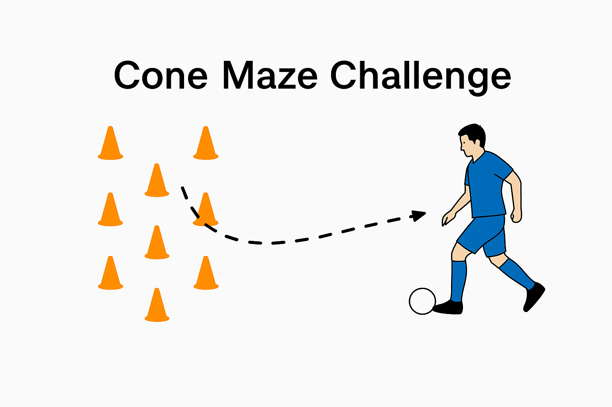

# 🔴 Lesson 1: Dribbling Like a Pro  
**Team:** U12 Boys  
**Duration:** 1 Hour  

---

## 🌟 Introduction  
This session focuses on dribbling technique, helping players gain confidence with the ball at their feet while learning to change direction and pace. The goal is to reinforce control, creativity, and awareness in tight situations.

---

## 🟠 Session 1: Cone Maze Challenge (20 mins)  

**Purpose:**  
Improve ball control through tight spaces.  

**Resources Needed:**  
- 15 cones  
- 1 ball per player  

**Setup Illustration:**  
  

**Key Concepts:**  
- Body positioning  
- Close control with both feet  
- Keeping head up  

**How to Run It:**  
1. Create cone maze with multiple turns and loops.  
2. Players dribble through, navigating without touching cones.  
3. Add competitive timing or backward dribble sections.  
4. Introduce rule variations like “only outside of foot.”

---

## 🟠 Session 2: 1v1 Duel Zone (20 mins)  

**Purpose:**  
Develop creativity and confidence in beating an opponent.  

**Resources Needed:**  
- 8 cones  
- 1 mini goal  
- 1 ball per pair  

**Setup Illustration:**  
  

**Key Concepts:**  
- Change of pace  
- Use of feints and turns  
- Shielding the ball  

**How to Run It:**  
1. Create small duel zones where players face off 1v1.  
2. Attacker tries to beat defender and score.  
3. Defender rotates after each attempt.  
4. Offer bonus points for successful skills like Cruyff turn or step-over.

---

## 🟠 Session 3: Dribble & Score Mini Game (20 mins)  

**Purpose:**  
Apply dribbling in match-style play.  

**Resources Needed:**  
- Marked mini-pitch  
- Small goals  
- 2 balls  

**Setup Illustration:**  
  

**Key Concepts:**  
- Decision-making on dribble vs pass  
- Controlled touches at speed  
- Anticipation and reaction  

**How to Run It:**  
1. 3v3 or 4v4 match where goals only count after successful dribble past defender.  
2. Add “dribble zones” players must enter before scoring.  
3. Rotate players to cover all positions.  
4. Highlight successful skills during cooldown discussion.
