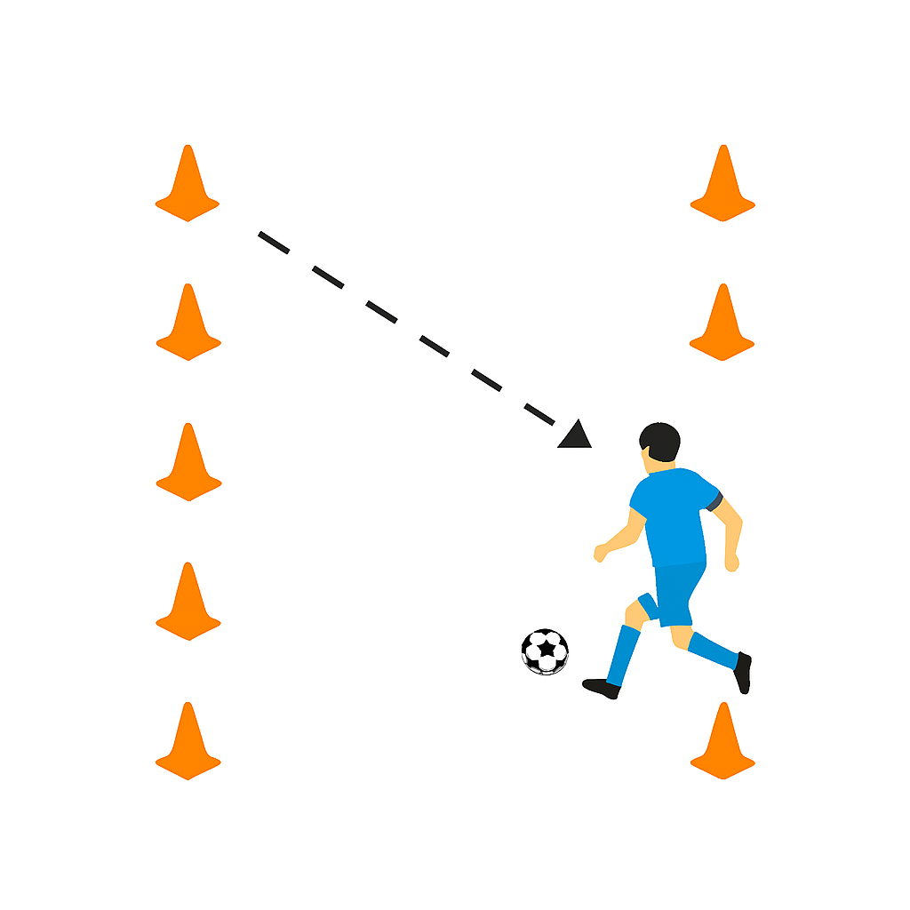
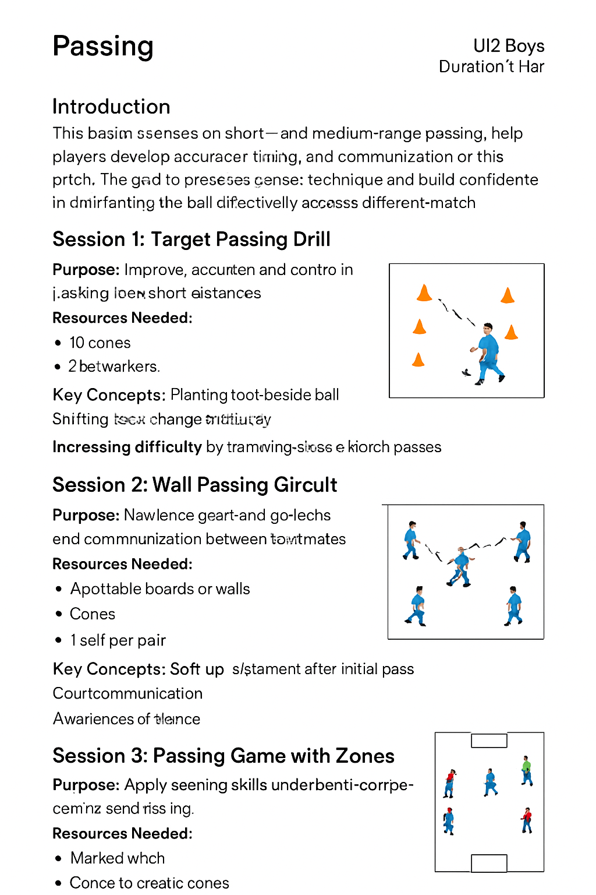
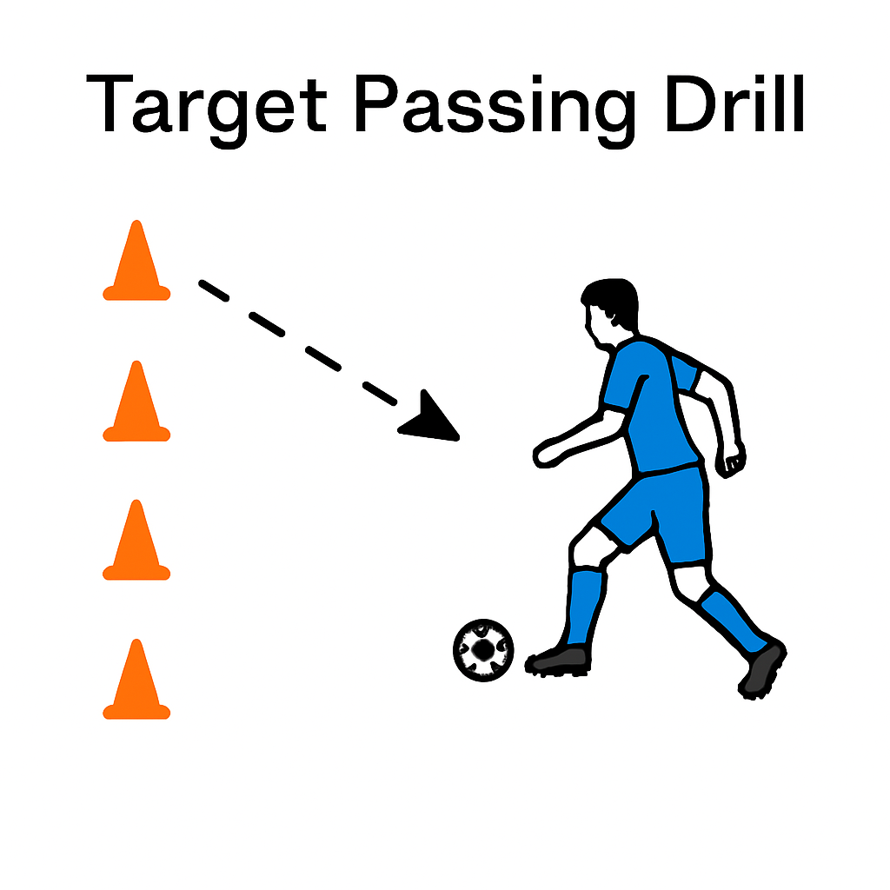

# 🟢 Lesson 1: Perfecting the Art of Passing  
**Team:** U12 Boys  
**Duration:** 1 Hour  

---

## 🌟 Introduction  
This session focuses on short- and medium-range passing, helping players develop accuracy, timing, and communication on the pitch. The goal is to reinforce proper technique and build confidence in distributing the ball effectively across different match scenarios.

---

## 🔹 Session 1: Target Passing Drill (20 mins)  

**Purpose:**  
Improve accuracy and control in passing over short distances.  

**Resources Needed:**  
- 12 cones  
- Flat markers  
- 1 ball per player  

**Setup Illustration:**  
  

**Key Concepts:**  
- Planting foot beside ball  
- Striking with instep  
- Adjusting power for distance  

**How to Run It:**  
1. Create gates using two cones, spaced 1 meter apart.  
2. Players must pass through gates from varying angles and distances.  
3. Award points for consecutive accurate passes.  
4. Increase difficulty by narrowing gates or using one-touch passes.

---

## 🔹 Session 2: Wall Passing Circuit (20 mins)  

**Purpose:**  
Reinforce give-and-go techniques and communication between teammates.  

**Resources Needed:**  
- 4 rebound boards or walls  
- Cones  
- 1 ball per pair  

**Setup Illustration:**  
  

**Key Concepts:**  
- Timing and movement after initial pass  
- Clear communication  
- Awareness of space  

**How to Run It:**  
1. Set up stations where players pass into wall, receive back, and move to new cone.  
2. Players cycle through stations in pairs.  
3. Add a time challenge or require 2-touch combinations.  
4. Progress to dynamic movement sequences.

---

## 🔹 Session 3: Passing Game with Zones (20 mins)  

**Purpose:**  
Apply passing skills under semi-competitive conditions.  

**Resources Needed:**  
- Marked pitch  
- Cones to create zones  
- 2 balls  
- Small goals  

**Setup Illustration:**  
  

**Key Concepts:**  
- Reading space  
- Supporting teammates  
- Passing under pressure  

**How to Run It:**  
1. Divide field into 3 vertical zones.  
2. Teams score by completing 5 passes within a zone before switching.  
3. Encourage movement off the ball and positioning.  
4. Rotate roles so all players experience midfield and forward positions.
